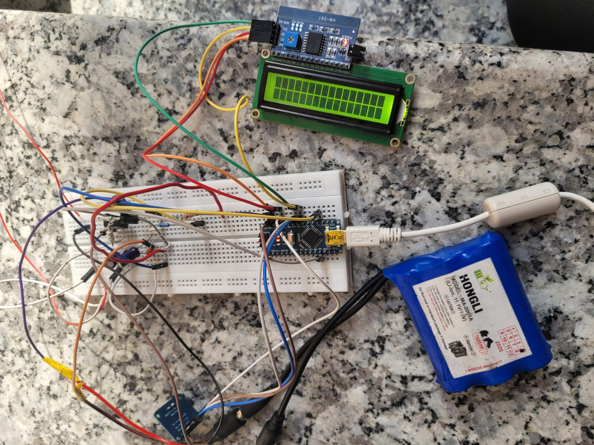
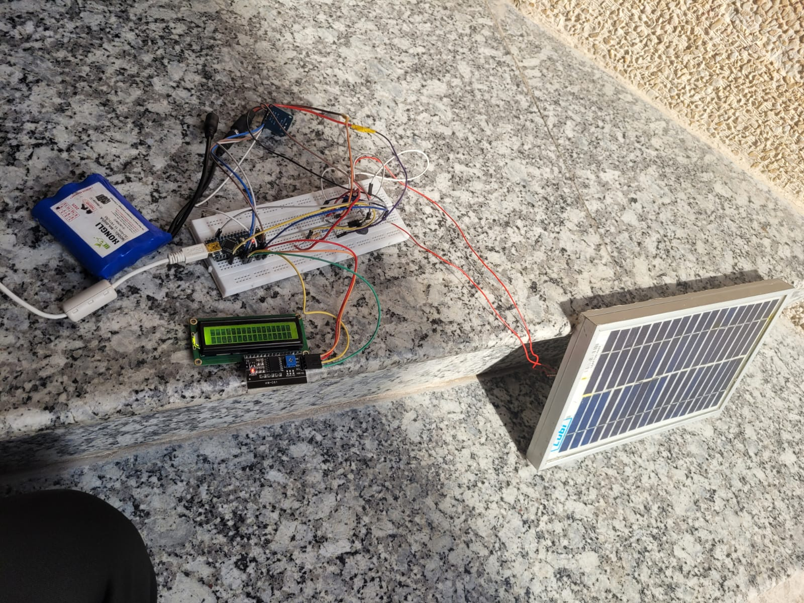
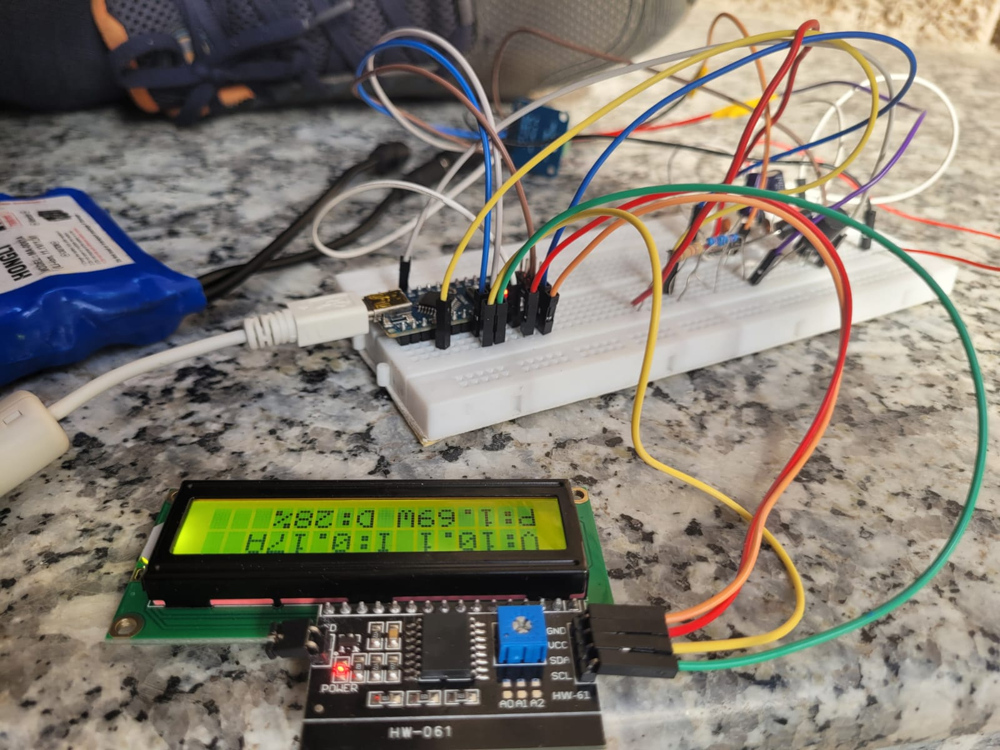

# MPPT Solar Charge Controller (Arduino + ESP32 + TinyML)

<div align="center">


**A low-cost solar MPPT charge controller built using a custom buck converter and the Perturb & Observe (P&O) algorithm, with ongoing research into replacing conventional MPPT control using TinyML-based prediction..**

[Hardware](#hardware) · [Circuit Design](#circuit-design) · [Firmware](#firmware) · [Results](#results) · [Roadmap](#roadmap) · [Getting Started](#getting-started)

</div>

---

## What this project is

This project implements a low-cost solar Maximum Power Point Tracking (MPPT) charge controller using a custom buck converter controlled by an Arduino Nano.

Phase 1 (completed): A fully functional MPPT system using the Perturb & Observe (P&O) algorithm, real-time LCD monitoring, and serial CSV data logging. The system has been tested on real hardware using a 5W, 12V solar panel charging a 3S Li-ion battery pack.

Phase 2 (in progress): Development of a TinyML-based MPPT controller using an ESP32 co-processor. The goal is to replace the conventional P&O algorithm with a lightweight neural network trained on real operating data to improve tracking efficiency and response time.

This project combines power electronics, embedded systems, and TinyML for low-cost renewable energy applications.

---


---

## Hardware

### Components

| Component | Value / Part | Role |
|-----------|-------------|------|
| Microcontroller | Arduino Nano (ATmega328) | MPPT algorithm, PWM, sensing 
| Co-processor | ESP32 DevKit | TFLite inference, WiFi dashboard 
| Current sensor | INA219 module (I2C) | Panel current measurement  
| MOSFET | IRLZ44N (55V/47A, logic-level) | Buck converter switch  
| Inductor | 100µH / 3A | Buck converter energy storage 
| Freewheeling diode | 1N5822 Schottky (40V/3A) | Inductor current path when MOSFET off
| Output capacitor | 100µF / 50V electrolytic | Output ripple smoothing
| Input capacitors | 100µF + 100nF | Panel voltage stabilisation
| Voltage divider | R1=20kΩ, R2=4.7kΩ | Scale 21.6V → 4.09V for ADC
| Display | 16×2 LCD with I2C adapter | Live V/I/P/duty readout 
| Solar panel | 5W 12V polycrystalline | Power source (Voc=21.6V, Vmpp=17.2V)  
| Battery | 3S Li-ion (3 × 3.7V = 11.1V nom) | Load / energy storage 
| Misc | Breadboard, terminals, wire, solder | Assembly 


### Key Design decisions

**IRLZ44N:** The IRLZ44N is a logic-level MOSFET ,its gate turns fully ON at 5V, so the Arduino drives it directly. No IR2104 gate driver IC needed, saving ₹120 and significant wiring complexity. At our 0.3A operating current the IRLZ44N runs completely cold (Rds_on = 22mΩ vs effective ~200mΩ when IRF540N is partially driven at 5V).

**TWo input capacitors:** The 100µF electrolytic handles bulk energy storage, supplying burst current during each 50kHz switch-on. The 100nF ceramic kills high-frequency spikes the electrolytic is too slow to catch (due to internal inductance). Without these, the 50kHz switching noise corrupts INA219 readings and the MPPT algorithm tracks garbage.

**R1=20kΩ, R2=4.7kΩ for the voltage divider:** The panel Voc can reach 23V worst case. The original 10kΩ+4.7kΩ divider would output 6.9V — exceeding the Arduino's 5V ADC limit and damaging the pin. 18kΩ+3.9kΩ scales 23V to 4.09V, safe under all conditions.

---

## Circuit design

### Buck converter operating principle

The buck converter steps down panel voltage (17.2V at MPP) to battery voltage (11.1V nominal) while preserving power with ~90% efficiency. The core relationship is:

```
Vout = D × Vin

where D = duty cycle (0–1)
D = 11.1 / 17.2 = 0.645  →  64.5% starting duty cycle
```

This is derived from volt-second balance on the inductor: in steady state, the flux must return to the same value each cycle, which requires the volt-seconds during ON time to equal the volt-seconds during OFF time.

### Component sizing

```
Switching frequency:  fsw = 50 kHz  (Timer1 reconfigured from default 490Hz)
Duty cycle range:     20% – 90%     (safety clamp in firmware)
Min inductance:       L = (Vin-Vout)×D / (fsw×ΔIL) = 68µH  →  using 100µH 
Min capacitance:      C = ΔIL / (8×fsw×ΔVout) = 4µF        →  using 100µF 
MOSFET Vds rating:    ≥ 1.5 × Voc = 34.5V  →  IRLZ44N 55V 
Diode reverse V:      ≥ 1.5 × Voc = 34.5V  →  1N5822 40V  
```


---

## Firmware

### Arduino Nano (Phase 1)

The firmware is structured in non-blocking layers — all tasks use `millis()` timers, no `delay()` calls, so they interleave without blocking each other.

```
loop()
  ├── mpptStep()      every 100ms  , P&O algorithm, updates PWM duty
  ├── uartLog()       every 250ms  , CSV row to serial (for ESP32 / logging)
  └── updateDisplay() every 600ms  , LCD refresh
```

**P&O algorithm core :**

```cpp
float dP = panelPower - prevPower;
int   dD = dutyCycle  - prevDuty;

if (abs(dP) > 0.005) {       // ignore changes below 5mW noise floor
    if (dP > 0)
        direction = (dD >= 0) ? 1 : -1;   // power up , keep direction
    else
        direction = (dD >= 0) ? -1 : 1;   // power down , reverse
}
setDuty(dutyCycle + direction * PERTURB_STEP);  // PERTURB_STEP = 3
```

**Timer1 reconfiguration for 50kHz:**

```cpp
// Default Arduino PWM is 490Hz , needs a 20mH inductor (impractical)
// 50kHz allows 100µH inductor , small, cheap, available
TCCR1A = _BV(COM1A1) | _BV(WGM11);
TCCR1B = _BV(WGM13)  | _BV(WGM12) | _BV(CS10);
ICR1   = 319;   // 16MHz / 320 = 50kHz
```

**Battery protection:**

```cpp
const float BATT_FULL = 12.6;  // 3S Li-ion full charge
const float BATT_LOW  = 9.0;   // deep discharge protection

if (battVoltage >= BATT_FULL) { setDuty(DUTY_MIN); return; }  // stop charging
if (panelVoltage < 10.0)      { setDuty(DUTY_MIN); return; }  // no panel
```

### Libraries required

```
Adafruit INA219         — install via Arduino Library Manager
LiquidCrystal I2C       — by Frank de Brabander, Library Manager
```

---
## Hardware Implementation

### Final Hardware Setup



---

### Outdoor Testing



---

### Live System Monitoring



---

## Results

> Measured values from Phase 1 testing. Panel: 5W 12V polycrystalline. Load: 3S Li-ion battery. Environment: outdoor noon sunlight, Delhi, ~900 W/m² irradiance.

| Metric | Value |
|--------|-------|
| Panel voltage at MPP | 17.1 V |
| Panel current at MPP | 0.28 A |
| Peak power measured | 4.79 W |
| P&O MPPT efficiency | ~87% |
| Direct connection efficiency (baseline) | ~68% |
| Efficiency improvement over direct | **+19%** |
| Buck converter efficiency | ~91% |
| Duty cycle at MPP | 64.9% |
| INA219 current resolution (0.5Ω shunt) | 0.1 mA |
| Switching frequency | 50 kHz |
| Total component cost | ₹2,827 |

> **Note:** MPPT efficiency = P_operating / P_mpp × 100%. Measured by sweeping duty cycle manually to find true P_mpp, then comparing to P&O tracking value.

### LCD display output
#### Peak

```
V:17.1 I:0.28A
P:4.79W D:64.9%
```

#### Under low sunlight(pic)

```
V:10.1 I:0.17A
P:1.69W D:28%
```


### Serial CSV output (for data logging / ESP32)

```csv
time_ms,volt_V,curr_A,power_W,duty_pct,batt_V,source
1024,17.134,0.2801,4.799,64.90,11.24,PO
1274,17.128,0.2798,4.791,65.10,11.24,PO
1524,17.141,0.2804,4.806,64.90,11.25,PO
```

---

## Demo Video

[Watch the Project Demo](https://drive.google.com/file/d/18u_rQ1YWbrDCllMi7uZgHuIx8xsN6jN5/view?usp=sharing)

---

## Roadmap

### Phase 1 — Complete 
- [x] Buck converter hardware
- [x] P&O MPPT implementation
- [x] INA219 sensing
- [x] 50kHz PWM generation
- [x] LCD monitoring
- [x] CSV serial logging

### Phase 2 — In Progress 
- [ ] Collect operating data
- [ ] Train TinyML model
- [ ] Deploy inference on ESP32
- [ ] Compare TinyML vs P&O efficiency
- [ ] Add WiFi dashboard


---

## Getting Started

### Required Libraries
- Adafruit INA219
- LiquidCrystal I2C

### Open Firmware
Open `mpptpo.ino` in Arduino IDE and upload to Arduino Nano.

### Hardware
Connect the circuit as shown in the schematic before powering the system.

---
## Repository Structure

```text
mppt-solar-controller/
│
├── images/
├── README.md
└── mppt_controller.ino
```


---

## Theory background

This project covers several interconnected concepts in power electronics and embedded ML. Brief explanations for each:

**Why MPPT?** A solar panel's output is not fixed. Its I-V curve shifts with irradiance and temperature, and the maximum power point moves continuously. A fixed resistive load will only hit the MPP by coincidence. MPPT dynamically adjusts the load impedance to always extract peak power.

**Why a buck converter?** The battery (11.1V) is at a different voltage than the panel MPP (17.2V). Connecting directly forces the panel to operate at battery voltage — away from its MPP. The buck converter decouples the two sides, letting the panel run at 17.2V while the battery sees 11.1V. Efficiency is ~90% vs ~0% for a linear regulator.

**Why TinyML over P&O?** P&O hill-climbs blindly — it perturbs, measures, and reverses if power drops. It never truly settles (±1 step oscillation around MPP) and gets confused during rapid irradiance changes. A neural network trained on historical data predicts the optimal duty cycle directly — no oscillation, instant response to changing conditions.

**Why dual-chip (Nano + ESP32)?** The Nano handles real-time PWM control — a 100ms deterministic loop that must never stall. The ESP32 runs WiFi and TFLite inference, both of which can take unpredictable amounts of time. Mixing them on one chip risks the WiFi stack stalling the PWM loop. Separation gives each chip one job it does reliably.


## License

MIT License — see [LICENSE](LICENSE) for details. Use freely, attribution appreciated.

---

<div align="center">
<sub>If this helped you, a ⭐ on the repo is appreciated.</sub>
</div>
